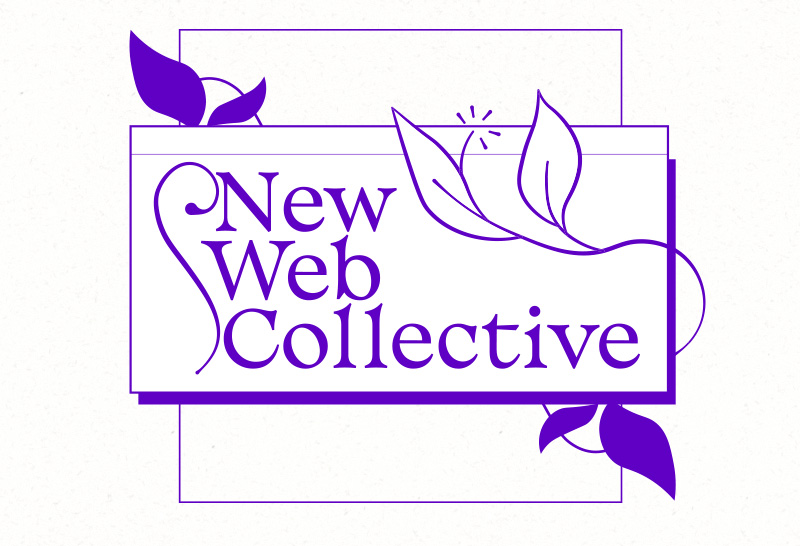

# The New Web Collective



## The Content Renderer

`render.py` serves as a very simple static CMS for the Collective; it wraps content around a theme file, and lets you set properties like the title, `meta` description, and so on for each page.

First, add the theme file itself, defined by `TMPL_FILE` in `render.py` - this is what will get copied and appended for each source file. Use `$CONTENT` as the placeholder for your body content. Next, Add a sidebar file, defined by `SB_FILE`. This will replace `$SIDEBAR` in your theme file. You can use `$URL` as a substitution at any point in this chain. (And, you can also set `$DESC` for a generic description in case a page-specific one is missing.)

Create source files and specify their output location using `files.json`. It should be formatted like this:

```json
[
  {
    "src": "src/my-test.html",
    "dest": "my-test.html",
    "desc": "A test page!"
  }
]

```

Running `render.py` will format all of the files listed in `files.json`; it will warn you if anything has gone awry. If you run it with the `-l` argument it will substitute your local path as the URL (i.e., for testing), so __make sure you run it without arguments before pushing your changes__.
